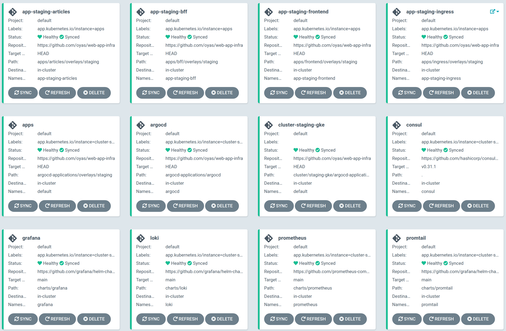

web-app-infra
=====

Kubernetes manifests of [web-app](https://github.com/oyas/web-app).



## Setup

### Create local cluster

```
bash cluster/local/setup.sh
```

After creating, you can access to http://localhost:8080/

#### Admin tools

```
bash cluster/local/port-forward.sh
```

- [Argo CD](http://localhost:20000/) ( username: `admin` / password: `admin` )
- [Consul](http://localhost:20001/)
- [Grafana](http://localhost:20002/) ( username: `admin` / password: `admin` )
- [Alertmanager](http://localhost:20003/)
- [Prometheus](http://localhost:20004/)

